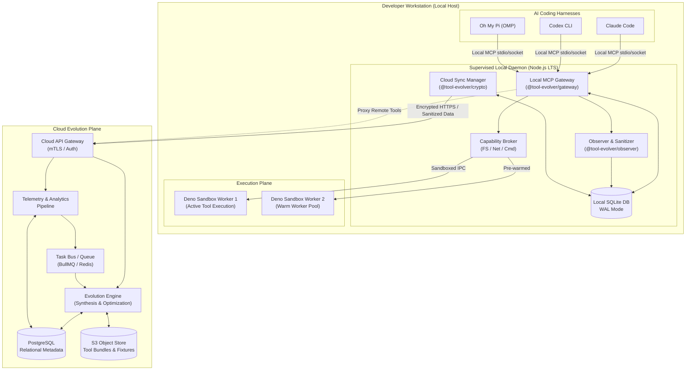

# Tool Evolver Architecture Overview

## Executive Summary

**Tool Evolver** is an autonomous, privacy-preserving infrastructure system that observes AI coding agent workflows, detects performance bottlenecks and repetitive tool patterns, and autonomously synthesizes, verifies, sandboxes, and deploys optimized Model Context Protocol (MCP) tools directly to developer workstations.

The architecture is divided into two primary tiers:
1. **Local Workstation Tier**: A lightweight, user-level background daemon providing a unified Local MCP Gateway, real-time Observer, sandboxed Deno execution workers, embedded SQLite storage, and a pre-authorized Capability Envelope.
2. **Cloud Evolution Tier**: A scalable backend providing multi-tenant tool registry cataloging, asynchronous synthesis pipelines, test generation, and anonymized collective telemetry aggregation.

## System Topology & Architecture Diagram

## Core Local Components

### 1. Local MCP Gateway (`@tool-evolver/gateway`)
The Local MCP Gateway is the single point of contact for all AI coding harnesses on the developer's machine ([ADR 0001](../adr/0001-v1-topology.md)). It:
- Exposes standard Model Context Protocol (MCP) endpoints via stdio, Unix domain sockets, and localhost HTTP/SSE.
- Dynamically routes tool invocations to local sandboxed workers or proxies to cloud-hosted tools.
- Maintains in-memory routing tables for instant, sub-100ms canaries and rollbacks ([ADR 0008](../adr/0008-canary-and-rollback.md)).
- Adds less than 2ms ($p50$) routing latency overhead ([ADR 0009](../adr/0009-nfr-and-performance-targets.md)).

### 2. Observer & Sanitizer (`@tool-evolver/observer`)
The Observer passively monitors tool executions, transcript interactions, and performance metrics:
- Records raw execution traces into local SQLite ([ADR 0005](../adr/0005-privacy-data-boundaries.md)).
- Runs a multi-stage local redaction pipeline to scrub credentials, private paths, and PII.
- Generates sanitized observation summaries for the evolution engine.

### 3. Capability Broker (`@tool-evolver/runtime`)
The Capability Broker enforces the pre-authorized **Capability Envelope** ([ADR 0007](../adr/0007-capability-envelope-and-security.md)):
- Mediates all filesystem, network, and subprocess access from tool workers.
- Restricts filesystem access to authorized workspace roots and prevents access to sensitive files (`.git`, `.env`).
- Restricts network calls to whitelisted domains and blocks unauthorized shell spawns.

### 4. Deno Execution Sandbox (`@tool-evolver/runtime`)
Executes tool code in hermetically isolated, pinned Deno worker subprocesses ([ADR 0002](../adr/0002-daemon-and-worker-isolation.md)):
- Enforces hard memory limits (30MB per worker) and execution timeouts (30s).
- Isolates faults so a crashing or hung tool never terminates the gateway.
- Leverages a pre-warmed worker pool for sub-5ms warm invocation execution.

### 5. Local Storage (`@tool-evolver/db`)
Embedded SQLite with Write-Ahead Logging (WAL mode) providing zero-configuration, microsecond-latency state management ([ADR 0006](../adr/0006-storage-and-runtimes.md)):
- Manages workspace scopes, tool registry metadata, candidate lifecycle states, and cryptographic audit logs.

## Core Cloud Components

### 1. Cloud API Gateway & Ingestion
- Authenticates local daemon sync sessions via mTLS or bearer tokens.
- Ingests sanitized observation batches and enqueues them for pattern analysis.

### 2. Evolution Engine & Task Queue
- Asynchronously processes aggregated telemetry to detect optimization opportunities (e.g., repetitive tool chains, slow query patterns).
- Synthesizes candidate MCP tools and workflows using specialized code models ([ADR 0004](../adr/0004-evolution-scope-and-autonomy.md)).
- Generates property-based contract test suites and publishes immutable tool bundles to S3.

### 3. Cloud Storage & Catalog
- **PostgreSQL**: Stores relational metadata, multi-tenant accounts, global tool catalogs, and aggregated metrics.
- **S3 Object Store**: Hosts immutable, cryptographically signed tool bundles and verification fixtures.

## Key Architectural Principles

1. **Local-First & Offline-Capable**: All local tools execute and function with 100% reliability even when completely disconnected from the internet.
2. **Zero-Approval Autonomy within Envelope**: Tools evolve, test, canary, and promote autonomously without prompting the developer, provided they stay within the pre-authorized security envelope.
3. **Strict Data Residency**: Proprietary source code and raw conversation turns never leave the local machine without explicit opt-in.
4. **Hermetic & Deterministic**: Pinned runtime binaries and comprehensive contract tests ensure identical behavior across Linux, macOS, and WSL2 ([ADR 0003](../adr/0003-supported-harnesses-and-platforms.md)).

## Architecture References

- [System Boundaries and Process Model](boundaries.md)
- [Canonical Architectural Glossary](glossary.md)
- [Non-Functional Requirements (NFR) Matrix](nfr.md)
- [ADR 0001: V1 Topology](../adr/0001-v1-topology.md)
- [ADR 0002: Daemon Architecture & Sandboxing](../adr/0002-daemon-and-worker-isolation.md)
- [ADR 0004: Evolution Scope & Autonomy](../adr/0004-evolution-scope-and-autonomy.md)
- [ADR 0005: Privacy & Data Residency](../adr/0005-privacy-data-boundaries.md)
- [ADR 0007: Capability Envelope & Security](../adr/0007-capability-envelope-and-security.md)
- [ADR 0008: Canary Lifecycle & Rollback](../adr/0008-canary-and-rollback.md)
- [ADR 0009: Non-Functional Requirements](../adr/0009-nfr-and-performance-targets.md)
- [ADR 0010: ADR Governance](../adr/0010-adr-governance.md)
